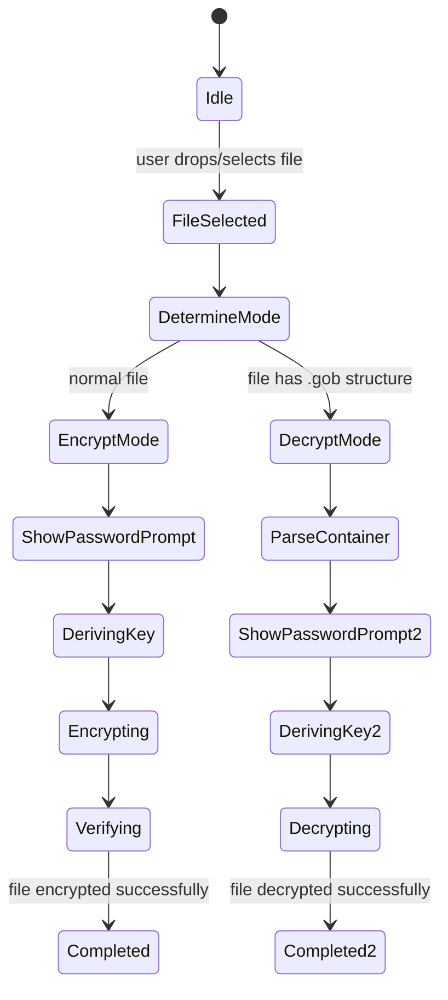

# Goblet v1 Project Blueprint

**Executive Summary:** Goblet v1 is a simple, secure web tool for client-side encryption of *one file at a time*.  It provides a friendly single-page web UI (public repo) and a private Cloudflare Worker backend.  Users drag-and-drop (or select) a file, enter a password, and Goblet produces a `.gob` container (JSON + AES-GCM ciphertext) for download.  Later, the user can upload a `.gob` and the correct password to decrypt it back.  All cryptography is done in-browser (via Web Crypto API) except a small KDF step on the Worker that combines the user’s password with a server-held secret (a “pepper”) to derive the AES key.  Goblet’s design goals are **privacy, simplicity, and robustness**: no user data ever leaves the browser unencrypted, no crypto choices are exposed to the user, and files are only returned when the correct password is supplied.  The public (frontend) and private (worker) codebases are clearly separated.  The container format is versioned and future-proof.  This blueprint documents V1 scope: single-file encryption/decryption, web UI, a Worker KDF endpoint, CORS config, error handling, and the `.gob` format. It does *not* cover folders, multi-file archives, streaming, or mobile apps (these are possible future enhancements). 

## Vision & Philosophy  
Goblet’s **vision** is to be the one-stop padlock for your digital files: *“I Goblet it; I Goblet it back.”*  Its **philosophy** is minimal trust: no sensitive data (file content or password) is ever sent in the clear, and the only secrets are your password and a server-side pepper.  By making encryption as easy as “drop file, enter password, download `.gob`,” Goblet demystifies crypto.  The whimsical Goblet mascot reinforces trust (“your file is safe with Goblet”) while the rigorous design ensures real security.  Future compatibility is a feature: every `.gob` carries a version number, so new Goblet releases can update formats without breaking old files.

## Scope (v1) – Goals and Non-Goals  
- **Goals (v1):** Single-file AES-256-GCM encryption/decryption in browser; derive key via KDF that uses both password and server secret; clear UX and state flow; container format with metadata; deploy frontend (Cloudflare Pages or GH Pages) and backend Worker (Cloudflare); strict CORS; robust error and edge-case handling; comprehensive tests.  
- **Non-goals (v1):** No folder/zip support, no streaming of large files, no passwordless access, no user accounts, no partial decrypt, no encryption of webpages themselves, no mobile/desktop native app.  Desktop “exe” and multi-file are explicitly deferred.  

## User Stories  
- *As a user, I want to drag & drop a file and a password, so I can download an encrypted `.gob` that only I can open later.*  
- *As a user, I want to upload a `.gob` and enter its password, so I can get back my original file.*  
- *As a security reviewer, I want all cryptographic operations done in-browser, with only key derivation on server.*  
- *As a developer, I want to trust that only our site can call the key-derivation API (via CORS).*  
- *As a product manager, I want error messages for wrong passwords, corrupt files, or unsupported inputs.*  
- *As a browser, I want progressive enhancement: file API works on modern browsers, with graceful fallbacks if features are missing.*  

## UX Flow and State Machines  

The Goblet frontend has two primary modes: **Encrypt** and **Decrypt**.  The user can toggle or is automatically in one mode based on file type (normal file vs `.gob`).  Below are simplified state diagrams for each flow.



- **Idle:** waiting for user to select or drop a file.  
- **DetermineMode:** check if the dropped file is a Goblet container or a plain file.  
- **EncryptMode:** user is offered to encrypt. Prompt for password.  
- **DecryptMode:** file is parsed as `.gob`. Prompt for password to decrypt.  
- **DerivingKey/Encrypting:** after password entry, the UI calls the Worker to derive the AES key, then uses SubtleCrypto to encrypt.  
- **Verifying:** after encryption, UI checks everything is correct (see “Self-Verification” below) then triggers download.  
- **ParseContainer/Decrypting:** in decrypt flow, parse JSON, derive key via Worker, decrypt via Web Crypto, verify (tag check) then download original.  
- **Completed:** final state when download is triggered or error shown.

**Progressive enhancement:** The app requires JavaScript and modern Web Crypto. If the browser lacks SubtleCrypto, we should show a message that Goblet requires a recent browser. (Support: Chrome, Firefox, Safari, Edge on desktop; iOS Safari 15+, Android 12+).  

## System Architecture  

```mermaid
flowchart LR
    subgraph User[Browser Client]
        U[User Interaction] --> FE[Frontend UI / JS]
        FE --> Subtle[(WebCrypto API)]
    end
    subgraph Infrastructure
        FE -->|HTTPS (password + salt)| Worker[Cloudflare Worker]
        Worker -->|derived key| FE
    end
    subgraph Crypto
        Subtle -->|AES-GCM| Encrypt[AES-GCM Encrypt/Decrypt]
        Subtle -->|PBKDF2| KDFsubtle[Key Derivation]
    end
```

1. **User (Browser):** Runs the Goblet frontend (JS/HTML/CSS). Handles UI and all cryptography except one step. Uses Web Crypto (`window.crypto.subtle`) for PBKDF2 and AES-GCM.
2. **Goblet Frontend (Public Repo):** Contains UI code, parses files, constructs the `.gob` JSON, and downloads files. Contains container parser to detect valid `.gob`. Does encryption/decryption with subtleCrypto.
3. **Cloudflare Worker (Private Repo “Goblet Internal”):** Exposes a single API endpoint (e.g. `POST /derive-key`). It receives JSON `{password, salt}` and returns a derived AES key. The Worker stores the **pepper** (secret salt) as an environment variable (Cloudflare Secret) and uses it with PBKDF2 to derive the key (see Cryptography section). The Worker enforces CORS and rate limits. All Worker logic (KDF parameters, secret) is private.
4. **Cryptography:** 
   - **PBKDF2-HMAC-SHA256:** used to stretch the password + pepper into a raw key (256 bits). Chosen for wide Web Crypto support. (NIST-approved and widely recommended.)
   - **Pepper (Server-Side Salt):** A constant secret (e.g. 16+ random bytes) kept in Worker’s env (`process.env.SECRET_PEPPER`). Not stored in code or container.
   - **AES-256-GCM:** used for encryption, providing confidentiality + integrity. GCM is the recommended AEAD mode for symmetric encryption (NIST’s SP 800-38D specifies GCM). The 12-byte IV is random per encryption (from `crypto.getRandomValues`). The 128-bit auth tag is included in the ciphertext output by Web Crypto. 
5. **Data Flow:** User selects file → frontend generates random salt (for KDF) and IV → calls Worker with password + salt → Worker does PBKDF2(secret+password) → returns raw key → browser AES-encrypts file → download `.gob`. Decrypt flow reverses this.

**Deployment:** Frontend can be hosted on Cloudflare Pages or GitHub Pages (serving static files). The Worker is deployed via Wrangler to Cloudflare Workers on `goblet.example`. The production site only calls the Worker via Fetch (HTTPS).  

## Repository Structure  

- **`Goblet` (public):**  
  - `index.html`, CSS/JS for UI.  
  - Static docs (README, `Gob_Docs/` etc, including this blueprint).  
  - File parser + AES encryption/decryption code (using Web Crypto).  
  - No secrets in this repo. Only UI logic and spec.  
- **`Goblet-Internal` (private):**  
  - `wrangler.toml` (Cloudflare config).  
  - `index.js` (Worker code).  
  - Defines endpoint(s): e.g. `POST /derive-key`.  
  - Contains KEY_DERIVATION parameters and calls to SubtleCrypto (or Node crypto) to perform PBKDF2-HMAC using the server salt.  
  - Uses a secret environment variable (e.g. `SECRET_PEPPER` or `MASTER_SECRET`) for the pepper.  
  - Enforces CORS and any rate-limits (see below).  

**Environment & Secrets:** In Wrangler config or Cloudflare Dashboard, we define:  
| Name             | Description                                   | Value (example)                      |
|------------------|-----------------------------------------------|--------------------------------------|
| `SECRET_PEPPER`  | Global secret salt (pepper) for KDF (Bytes)   | *set via `wrangler secret put`*      |
| `ALLOWED_ORIGINS`| Allowed CORS origins (space-separated list)   | `https://goblet.example https://localhost:3000` |

*Security:* `SECRET_PEPPER` is marked a *Secret* in Cloudflare (never committed). During local dev, use a `.env` or Wrangler’s secret store.  Avoid storing the pepper in plaintext `vars`.  

## Encryption Workflow  

1. **File Metadata:** On file selection, record original filename (`originalName`) and timestamp. (Optionally compute content type or size for user feedback.)  
2. **Generate Salt & IV:** Create a random 16-byte salt (`salt = crypto.getRandomValues(new Uint8Array(16))`) and a random 12-byte IV (`iv = crypto.getRandomValues(new Uint8Array(12))`).  
3. **Derive Key (Worker Call):** POST to Worker endpoint `/derive-key` with JSON `{password: "userPass", salt: base64(salt)}`. Worker does:  
   ```js
   // Worker (Node or Subtle) pseudocode
   const keyMaterial = await crypto.subtle.importKey("raw", encodeUTF8(password), {name: "PBKDF2"}, false, ["deriveKey"]);
   const derivedKey = await crypto.subtle.deriveKey(
     { name: "PBKDF2", salt: decodeBase64(salt), iterations: 200000, hash: "SHA-256" },
     keyMaterial,
     { name: "AES-GCM", length: 256 },
     true, 
     ["encrypt","decrypt"]
   );
   const rawKey = await crypto.subtle.exportKey("raw", derivedKey);
   // return rawKey (base64) to browser
   ```
   The **iteration count** (e.g. 200,000) should balance security vs performance; NIST/SP800-132 suggests ~600k+ for PBKDF2-SHA256, but we may start lower for usability. (Even at 200k, modern devices take a few hundred ms.) The Worker then responds with JSON `{ key: "<base64key>" }`.  
4. **Import Key & Encrypt:** In the browser, take the returned raw key, import it via `subtle.importKey` as an AES-GCM `CryptoKey`, then call `subtle.encrypt({name:"AES-GCM", iv:iv, additionalData: []}, aesKey, fileBytes)`. This yields a ciphertext (`ArrayBuffer`) which includes the 16-byte auth tag at the end.  
5. **Assemble Container:** Build a JSON object for the `.gob` file (see *Container Spec* below). Include `version`, `timestamp`, `originalName`, base64-encoded `salt`, base64 `iv`, and base64 `ciphertext`. Serialize this JSON, then trigger a download (e.g. using a blob and `URL.createObjectURL`).  
6. **Self-Verification (optional):** For safety, attempt to decrypt the ciphertext in-memory immediately after encryption (before download) to verify correctness. If decrypt fails (unexpected), abort and show error.  

## Decryption Workflow  

1. **Parse `.gob`:** User uploads a `.gob`. The app reads it as text, parses JSON, and validates fields. If JSON parse fails or required fields are missing or wrong version, show an error.  
2. **Show Metadata:** (Optional) Display original file name, creation date, etc., from the JSON.  
3. **Prompt Password:** Ask user for password.  
4. **Derive Key:** Generate the same salt buffer from the JSON (`salt`) and call Worker `/derive-key` with `{password, salt}`. Receive base64 key back. Import as CryptoKey.  
5. **AES-GCM Decrypt:** Call `subtle.decrypt({name:"AES-GCM", iv: iv, additionalData: []}, aesKey, ciphertext)`. If the password is correct, this returns the original file bytes. If the auth tag check fails (wrong password or tampering), an exception is thrown. Catch this to show a “wrong password or corrupt file” error.  
6. **Download Original:** If decrypt succeeds, take the resulting `ArrayBuffer`, turn into a Blob, and trigger a download with the original filename (`originalName`).  

## `.gob` Container Specification  

Goblet containers have a simple JSON format. They carry all needed metadata (including KDF salt) plus the ciphertext. Future versions can add fields but **must keep backward compatibility**. Below is the v1 layout:

| Field          | Type     | Description                                                                                |
| -------------- | -------- | ------------------------------------------------------------------------------------------ |
| `version`      | number   | Container format version (1 for now).                                                      |
| `timestamp`    | string   | ISO-8601 or UNIX epoch when encrypted (for user info, not security-critical).             |
| `originalName` | string   | Original filename (including extension) of the file.                                      |
| `salt`         | string   | **Base64** of the random salt used in PBKDF2 (16 bytes).                                   |
| `iv`           | string   | **Base64** of the AES-GCM IV (12 bytes).                                                   |
| `ciphertext`   | string   | **Base64** of the AES-GCM ciphertext+authTag of the file contents.                         |
| `kdf` (opt)    | string   | *Optional* KDF algorithm (e.g. `"PBKDF2"`).                                               |
| `kdfParams`(opt)| object  | *Optional* e.g. `{ "hash": "SHA-256", "iterations": 200000 }` for future flexibility.    |
| `cipher` (opt) | string   | *Optional* cipher name (`"AES-GCM"`). Defaults implied to AES-GCM with 128-bit tag).      |

Example `.gob` (minified):  
```json
{"version":1,"timestamp":"2026-07-16T12:34:56Z","originalName":"secret.pdf","salt":"AbCd...Base64...EfGh","iv":"IjKl...","ciphertext":"Xyz..."}
```

All Base64 fields should use URL-safe or standard Base64 without line breaks. No sensitive secret is included in the JSON. On decryption, the `version` field allows future code to select the correct parsing logic.  

**Integrity:** AES-GCM provides integrity over the ciphertext, but it does *not* authenticate the JSON metadata. This means attackers could tamper with `timestamp` or `originalName` fields without detection; only the ciphertext/authTag check will catch modifications of the encrypted data. If metadata integrity is needed later, version 2 could include an HMAC or include fields as AAD. For v1 we assume metadata is not sensitive.  

## Cryptographic Pipeline Details  

- **Password Stretching (KDF):** We use PBKDF2 with HMAC-SHA256. This is well-supported in browsers (`crypto.subtle.deriveKey`) and is FIPS-validated. The KDF inputs: *user password*, *random salt (from container)*, *secret pepper (env)*. The iteration count is set high (e.g. 200,000 or more) to slow brute-force. (NIST suggests ≥600,000 for SHA-256; actual choice balances UX performance.) Using a high iteration count thwarts offline guessing.  
- **Pepper (Salt from Env):** A constant secret (e.g. 16 random bytes) stored in `SECRET_PEPPER`. We incorporate it by, for example, pre-hashing: `keyMaterial = HMAC-SHA256(pepper, password)` or post-hash: running the PBKDF2 output through HMAC with pepper. OWASP recommends combining a pepper with a password hash for defense-in-depth. Here, simplest is to include the pepper bytes in the salt argument to PBKDF2 (e.g. salt = pepper||randomSalt) or use it as an HMAC key after PBKDF2. *Important:* Changing the pepper invalidates all existing `.gob` files (users would have to re-encrypt with the new pepper), so set once and keep it secure (rotate only if absolutely necessary, and then inform users to reencrypt).  
- **AES-GCM Details:** We use 256-bit AES keys (`length:256`). The IV is 96 bits (12 bytes) randomly generated per file, as recommended (12 bytes is the recommended length in NIST SP 800-38D). We include no AAD. The GCM tag (128 bits) is appended to ciphertext by SubtleCrypto. Because GCM is authenticated encryption, decryption will fail if the password is wrong or ciphertext is altered.  
- **Key Handling:** The worker returns a raw key to the browser, which is then imported into Web Crypto. Using `deriveKey(..., {extractable: true})` and immediately exporting as raw bits is simpler than directly deriving key in browser (since we need the pepper). All sensitive operations are ephemeral: the raw key is not stored anywhere after use.  

## Trust & Threat Model  

- **Trust:** We assume the user trusts the public front-end code (open source) and that Cloudflare securely stores the Worker secret. The Worker code and secret are kept private. The browser environment is trusted to perform crypto correctly (Web Crypto API is implemented by browser). We do not trust the network (user–worker comm is HTTPS) nor Cloudflare (it never sees unencrypted file data or password; it only sees salt and password in transit, but the communication is TLS-encrypted).  
- **Threats Mitigated:**  
  - *Eavesdropping:* Files and passwords never leave the browser unencrypted; only the password (in TLS) and salt go to Worker.  
  - *Server breach:* If the Worker’s code is breached, attacker learns the pepper. Combined with stolen `.gob` files, they could brute-force passwords offline. Hence the pepper and iteration count add defense depth.  
  - *Container tampering:* Altering ciphertext without correct password causes decrypt to fail (thanks to GCM authentication).  
  - *Wrong origin calls:* The Worker rejects requests from origins other than our frontend (see CORS).  
- **Assumptions:** The AES-256-GCM is secure if keys are random and IVs not reused. Web Crypto is implemented correctly. Users choose sufficiently strong passwords. The risk of password-guessing is limited by high iteration count and the secret pepper.  

## CORS Strategy  

Goblet’s worker must reject requests except from our own front-end domain (and localhost in dev). The Worker will:  
- Check the `Origin` header of each request. If it matches an entry in `ALLOWED_ORIGINS` (e.g. `https://goblet.example`, `http://localhost:3000`), set `Access-Control-Allow-Origin` to that origin. Otherwise, either omit the header or respond with 403. (Do *not* use `*`, as we restrict origins for security.)  
- For preflight `OPTIONS` requests, respond with `204 No Content` and headers:  
  - `Access-Control-Allow-Methods: POST, OPTIONS`  
  - `Access-Control-Allow-Headers: Content-Type`  
  - `Access-Control-Max-Age: 86400`  
  - `Access-Control-Allow-Origin: <origin>` (if allowed)  
  - `Vary: Origin` (when returning a specific origin, to ensure caches differentiate by origin).  
- For actual `POST` responses, include `Access-Control-Allow-Origin: <origin>` and `Vary: Origin`. Do not echo passwords or keys in response headers.  
- Example Worker CORS code (pseudo-JS):  
  ```js
  const ALLOWED = ["https://goblet.example", "http://localhost:3000"];
  addEventListener('fetch', e => {
    let origin = e.request.headers.get('Origin');
    let headers = {};
    if (ALLOWED.includes(origin)) {
      headers["Access-Control-Allow-Origin"] = origin;
      headers["Vary"] = "Origin";
      headers["Access-Control-Allow-Methods"] = "POST, OPTIONS";
      headers["Access-Control-Allow-Headers"] = "Content-Type";
    }
    if (e.request.method === "OPTIONS") {
      e.respondWith(new Response(null, { status: 204, headers }));
      return;
    }
    // ... handle POST ...
    // e.g., let response = handlePost(e.request);
    // e.respondWith(new Response(response.body, { headers }));
  });
  ```  
  This follows standard CORS practices.  In dev (`localhost`), add `http://localhost:...` to `ALLOWED_ORIGINS`.  

## Cloudflare Worker Architecture  

The Cloudflare Worker is a small JS module (ESM). Key points:  
- **Entry Point:** `fetch(request, env)` handler. Parses JSON body or returns errors.  
- **Endpoint:** `/derive-key` (method POST). Request JSON: `{ password: string, salt: base64 }`. Response: `{ key: base64 }` or error.  
- **Wrangler Config (`wrangler.toml`):**  
  ```toml
  name = "goblet-worker"
  compatibility_date = "2026-07-01"
  type = "javascript"

  [vars]
  ALLOWED_ORIGINS = "https://goblet.example http://localhost:3000"
  # Secret pepper stored via `wrangler secret put SECRET_PEPPER`
  ```  
  - Use `type = "javascript"` (ES module).  
  - `compatibility_date` pinned to a recent date (to ensure stable API).  
  - Do not put `SECRET_PEPPER` in `vars`; store it as a secret binding in Cloudflare (accessible as `env.SECRET_PEPPER`).  
- **Environment Variables:** (see table above)  
- **Rate Limiting:** Cloudflare automatically provides DDoS protection. We may add rudimentary rate limits (e.g. allow a few requests per minute per IP) by returning 429 if abused. (Out of scope for v1, but note in roadmap.)  
- **Error Codes:** Use standard HTTP statuses. For example:  
  - 200 OK with `{key}` on success.  
  - 400 Bad Request for malformed JSON or missing fields.  
  - 401 Unauthorized for wrong password? (Actually wrong password is only known client-side, so this worker only ever rejects invalid JSON.)  
  - 415 Unsupported Media Type if wrong content type.  
  - 500 Internal Server Error for unexpected exceptions.  
  
The Worker should catch errors and return JSON `{error:"message"}` with a non-2xx status.  Sensitive info (like stack traces) must not leak to client.

## API Contract  

The frontend talks to one endpoint: **POST** `/derive-key`.  The request and response bodies are JSON. Example:  

- **Request:** `POST https://goblet.example/derive-key`  
  ```json
  {
    "password": "hunter2",
    "salt": "AbCdEfGhIjKlMn=="
  }
  ```  
  (Salt is base64 of 16 random bytes; password is UTF-8 string, sent over HTTPS.)  

- **Response (success):** HTTP 200  
  ```json
  {
    "key": "ZaXc=="
  }
  ```  
  where `"key"` is base64 of the raw 32-byte AES key.  

- **Response (errors):** Appropriate status + `{ "error": "Description" }`. E.g., 400 if JSON malformed.  

All requests and responses should use `Content-Type: application/json`. The Worker will only parse JSON, and will reject other content types.

## Error Handling & Edge Cases  

We must anticipate and handle common problems. The UI and Worker should respond with clear messages.

- **File Selection:**  
  - *Multiple files:* Only one file is allowed. If user tries to drop more than one, show: “Please encrypt/decrypt one file at a time.”  
  - *No file:* If user triggers encrypt/decrypt without a file, disable buttons or show a prompt.  
  - *File too large:* Max file size is 25 MB. If exceeded, abort and show “File exceeds 25MB limit.” (25MB chosen as a safe in-browser limit.)  
  - *Empty (0-byte) file:* Still encryptable. Will produce a small ciphertext. Should work fine; produce a valid `.gob` with empty plaintext. On decrypt, result is empty file.  
  - *Hidden or special files:* If filename starts with `.`, still include it; the download will preserve it (e.g. `.env.gob` decrypts to `.env`). File paths are not preserved (only name).  
  - *Long filenames:* Browsers typically support very long names (hundreds of chars). We should safely use the entire name string for `originalName`. If extremely long (e.g. >255 chars), it should still work. Downstream OS may trim, but Goblet trusts what is given.  
- **Password Handling:**  
  - *Empty password:* We allow empty strings (zero-length) but it’s insecure; still, it produces a key. If a user does this, warn them that password is empty (maybe in UI).  
  - *Non-UTF8 password:* Since we send as JSON string, JS will UTF-8 encode it via `TextEncoder`. Non-ASCII (emoji, etc.) is fine (will be encoded). Important: decoding is consistent; the Worker should treat password exactly as UTF-8.  
  - *Wrong password:* On decrypt, if PBKDF2 yields wrong key, AES-GCM decryption will throw. Catch this and show “Incorrect password or corrupt file.” Do not reveal which.  
- **Container Parsing:**  
  - *Corrupted JSON:* If the uploaded `.gob` is not valid JSON, show “Invalid Goblet file.”  
  - *Missing fields:* If `version`, `salt`, `iv`, or `ciphertext` is missing or malformed (non-base64), error out.  
  - *Unsupported version:* If `version` != 1, show “Unsupported Goblet version.” (Future v2 logic will handle v2.)  
  - *Renamed file:* If a user renames `example.gob` to `foo.txt`, the app should still parse it by content. It should not rely on extension but on JSON structure.  
- **Worker Errors:**  
  - *Network failure:* If the call to `/derive-key` fails (timeout or non-200), show “Cannot derive key (service unreachable).” Suggest retry.  
  - *Worker exception:* If worker returns 500, show “An internal error occurred. Please try again later.” (Do not show raw error.)  
- **Concurrency / Cancellations:**  
  - If the user navigates away or hits “Back” during encryption, abort processing (if possible).  
  - If multiple derive-key calls in-flight (unlikely in v1), they must not conflict. (Each call is stateless.)  
- **Performance:**  
  - Encryption of 25MB with AES-GCM on modern browsers should take <1s. If it approaches multiple seconds, show a progress spinner or message “Encrypting…”.  
  - Similarly for decryption.  

A **table of key edge cases** and expected behavior:

| Scenario                       | Expected Behavior                          |
|-------------------------------|--------------------------------------------|
| No file selected              | Disable action buttons / show prompt        |
| Multiple files selected       | Error: “Select only one file.”             |
| File >25MB                    | Abort: “File exceeds 25MB limit.”          |
| Empty (0-byte) file           | Encrypts to small `.gob`; decrypts to empty|
| File with no extension        | Encryption works; originalName has no “.”  |
| File renamed to .gob w/ wrong content | Parse as JSON fails → “Invalid Goblet.” |
| Valid .gob, wrong password    | AES-GCM fails → “Incorrect password or corrupt file.” |
| Corrupted ciphertext (tampered) | AES-GCM fails → same message as wrong pwd.|
| Corrupted metadata (e.g. salt) | DeriveKey fails (invalid base64) → show error|
| Worker unreachable (404/timeout) | “Service unreachable. Try again.”         |
| Unsupported browser (no Web Crypto) | Disable UI; show “Browser not supported.”|

## File Limits & Performance Targets  

- **Max file size:** 25 MB. This is a practical limit to avoid browser memory exhaustion. At 25MB, encryption/decryption should complete in under ~1 second on typical hardware. Adjust as needed with profiling; show warning beyond this limit.  
- **Memory footprint:** Web Crypto will need to hold plaintext and ciphertext in memory. For 25MB, this is acceptable. Avoid creating multiple copies (use streams if v2).  
- **Key derivation time:** Aim for ~200–300 ms on target devices (adjust iterations). NIST recommends hashing <1s. Use a web worker or async call to avoid freezing UI.  

## Browser Compatibility & Progressive Enhancement  

- **Supported Browsers:** All major modern browsers with Web Crypto (AES-GCM & PBKDF2). According to MDN, Web Crypto is widely available since ~2016. Specifically: Chrome ≥ 37, Firefox ≥ 34, Safari ≥ 11 (iOS 11), Edge ≥ 14.  
- **Mobile:** Recent mobile browsers (Chrome on Android, Safari on iOS 15+) support SubtleCrypto. If a user on an unsupported platform loads Goblet, detect absence of `crypto.subtle` and show a message: “Your browser doesn’t support the required cryptography features. Please use a modern browser.” (No partial fallback is possible, since native crypto is required.)  
- **No JavaScript:** If JS disabled, show a notice that Goblet requires JavaScript. (This is a JS app, not static HTML.)  
- **Encoding:** We assume UTF-8. The frontend and worker must use the same encoding for password (e.g. via `new TextEncoder().encode(password)`), so international characters work.  

## Testing Strategy  

- **Unit Tests:** For key functions (container parser, base64 encoding/decoding, Web Crypto wrapper). Use a JS test framework (e.g. Jest) to test encryption/decryption roundtrips on small sample data (text, images).  
- **Integration Tests:** Automate end-to-end browser tests (e.g. with Puppeteer) to simulate file upload/encrypt/download and vice versa, checking contents.  
- **Cryptographic Validations:** Verify that encrypt→decrypt returns identical bytes (e.g. by hashing input/output) in tests. Test that wrong password fails. Test integrity: flip a bit in ciphertext and ensure decrypt throws.  
- **Worker Tests:** For the /derive-key endpoint, test with known password+salt to get a known key (using a small iteration count for speed). Test CORS headers via a fetch mock.  
- **Error Cases:** Write tests for empty file, missing JSON fields, malformed input to worker (e.g. no password field).  
- **Continuous Integration:** Set up CI (GitHub Actions) to run tests on push. Also linting (ESLint/Prettier) for code quality.  

## Deployment Checklist  

1. **Prepare Secrets:** Use `wrangler secret put SECRET_PEPPER` to set the pepper (generate with high entropy).  
2. **CORS Config:** Verify `ALLOWED_ORIGINS` covers production and dev domains.  
3. **Build Frontend:** Bundle/minify JS if used (though keep code readable). Ensure `index.html` points to correct Worker endpoint (prod URL).  
4. **Publish Frontend:** Deploy to Cloudflare Pages or GitHub Pages at `goblet.example`. Ensure HTTPS.  
5. **Deploy Worker:** `wrangler publish` the Worker for production. Set `compatibility_date` to latest stable.  
6. **Smoke Test:** Encrypt+decrypt a test file (e.g. a PDF) via the production site. Confirm correct behavior and inspect network: only one API call made, with correct JSON.  
7. **Environment Check:** Ensure production Worker only allows origin `goblet.example` (check `Fetch` on prod domain, then in console do a request from other origin – it should fail).  
8. **Version Tagging:** Tag this release as `v1.0.0` in Git. Record changes, including container spec version.  
9. **Documentation:** Publish `Gob_Docs/Goblet_Project_Blueprint.md` (this document) and container spec in `Gob_Docs/`. Include usage instructions in the README.  
10. **Monitoring:** Optionally integrate a log (e.g. Cloudflare logs) to monitor `/derive-key` calls and errors.  

## Versioning & Migration Plan  

- **Container Versioning:** Always include `version` in `.gob`. For v1, it is `1`. If the format changes in v2, Goblet should detect older versions and migrate (e.g. decrypt v1). This plan ensures future compatibility.  
- **API Versioning:** The Worker endpoint may include a version path (e.g. `/v1/derive-key`) in the future. For v1, we use `/derive-key`. Document this in the API table.  
- **Updating Crypto:** If KDF parameters or algorithms are updated (e.g. higher iteration or Argon2), old `.gob` must still decrypt under old scheme. This could be handled by storing the KDF parameters in the container (`kdfParams`) and branching code accordingly.  
- **Backward Compatibility:** V1 code should be able to decrypt any `.gob` marked `"version":1`. If v2 adds new fields, the parser should ignore unknown fields rather than fail.  

## Branding & Narrative Integration (Minimal)  

While Goblet’s frontend UI will be clean and minimal, small touches will echo the Goblet mascot theme:  
- Button texts like “Offer File” or “Retrieve Offering”.  
- Success messages like “File has been gobbled (encrypted)!” or “Your offering is returned.”  
- Error copy: “Goblet refuses to open this without the correct password.”  
However, do **not** overshadow clarity and professionalism. The mascot (digital “Goblet cell”) can appear in an about page or tooltip, but core UI focuses on functionality. Document with *Goblet narrative* in `Gob_Docs/Goblet_Narrative.md` (as previously written) for those interested.  

## References and Standards

- AES-GCM (authenticated encryption) is NIST-approved (SP800-38D) and strongly recommended by Web Crypto docs.  
- PBKDF2-HMAC-SHA256 is FIPS-validated and recommended by NIST/SP800-132 (use high iteration count).  
- Use a secret *pepper* (per OWASP) stored outside code.  
- Follow CORS best practices: echo the allowed origin, include `Vary: Origin`, and handle preflight.  
- Cloudflare Workers docs (Environment Variables, Errors, CORS examples) guide implementation.  

---

*This blueprint covers Goblet v1. Future versions may expand scope (multi-file, client-side KDF, etc.), but all must adhere to the core philosophy: files are safe only when the password is known.*